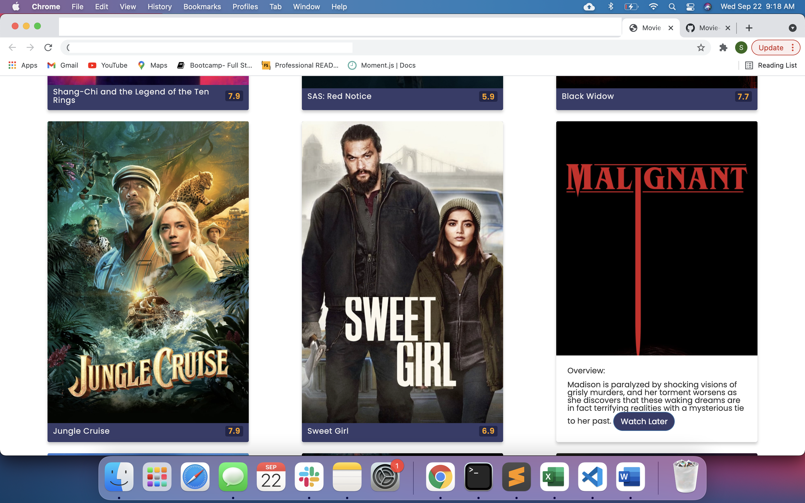
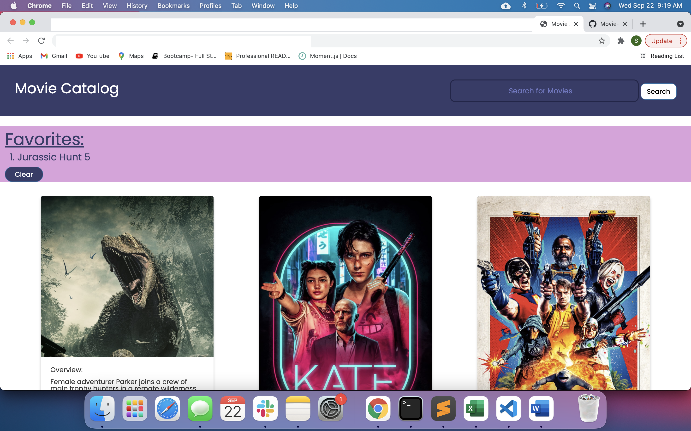
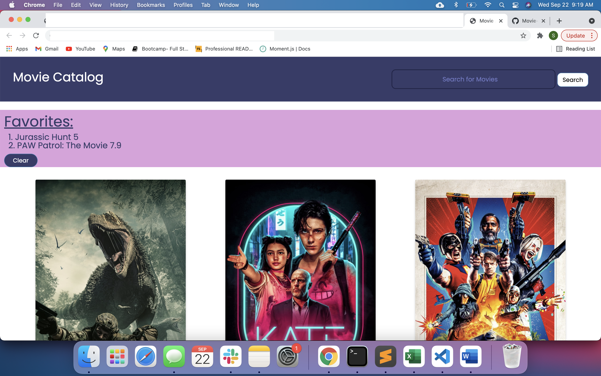

### Name of the Project: ###
Movie Catalog

### Description: ###
This is a web application, where we can find information about specific Movie and store your favorite Movie in "Favorites" section to watch later.

### Motivation: ###
The motivation behind this project is to learn and demonstrate HTML, CSS and Javascript coding skills. 
As we all are movie lovers, we wanted to build a minimalistic web application that simply lists all the latest movies and displays informtion about particular movie. 

### Technologies used: ###
    * HTML
    * CSS
    * Visual Studio Code Editor
    * Javascript
    * API-Themoviedb,omdb
    * Bootstrap

### Website Screen Shots: ###

### Website Contents: ###
1. Header consists of Title of the project, Search box and Button.
2. Search box provides an option to search for a particular Movie and get additional details regarding Movie.
3. Popular Movie cards are displyed on the Web page.
4. Each Movie card contains short discription and has option to add it to favorites list.  
5. All Movies added to favorites list will be displayed in the "favorite list" section on the top. This section has a button to clear the list.

Live deployed link:
https://github.com/daliyaebenny/Movie-Search.git
